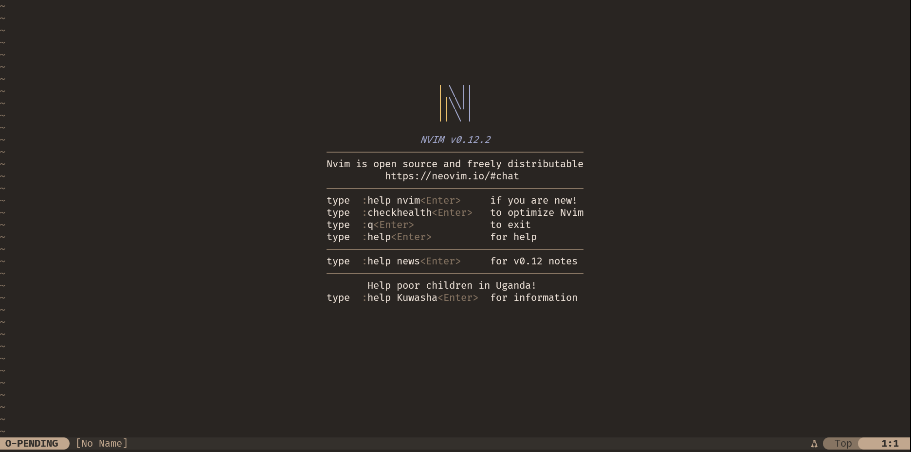
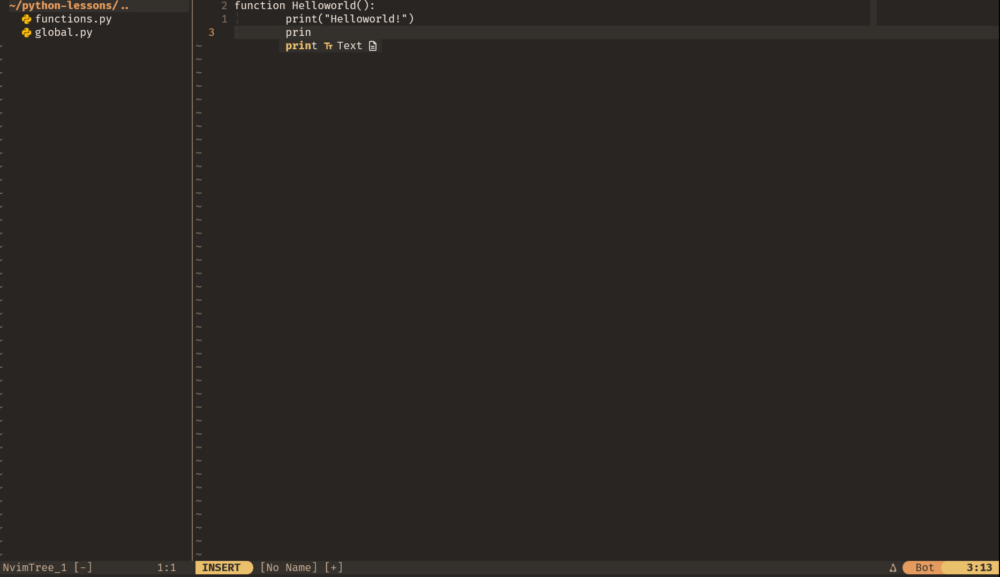

# Neovim IDE

A full Neovim + tmux IDE for **WSL2 and native Linux**, installed in one command.

---

## Preview

<p align="center">
  
  
</p>

<p align="center">
  <em>Startup screen &nbsp;&nbsp;|&nbsp;&nbsp; IDE in action — nvim-tree, melange theme, lualine</em>
</p>

---

## Quick Install

```bash
git clone git@github.com:oleevaqween/Neovim-IDE.git
cd Neovim-IDE
bash install.sh
```

The installer detects whether it's running on **WSL2** or **native Linux** and adjusts itself
accordingly (see [Platform Support](#platform-support)). It handles everything: Neovim, Node.js,
tmux, LSP servers, formatters, linters, and debug adapters.

---

## Platform Support

This started as a WSL2-only setup, but the Neovim/tmux config itself was never actually
Windows-specific — only the clipboard bridge was. The installer now detects the platform and
branches on that one difference:

| | WSL2 | Native Linux |
|---|---|---|
| Clipboard | `win32yank` (bridges to the Windows host clipboard) | `xclip` + `wl-clipboard` (covers both X11/XWayland and Wayland) |
| Everything else | identical | identical |

`config/lua/config/options.lua` already checks `vim.fn.has('wsl')` at runtime and only wires up
`win32yank` when it's actually on WSL2 — on native Linux it falls straight through to Neovim's
normal system-clipboard integration. No per-platform config forking needed.

---

## What Gets Installed

### System tools
| Tool | Purpose |
|------|---------|
| Neovim v0.11.0 | Editor (prebuilt tarball, no FUSE needed) |
| Node.js v20 LTS | Required for npm-based LSP tools |
| ripgrep | Fast grep, used by fzf-lua and Neovim search |
| fd-find | Fast file finder |
| tmux | Terminal multiplexer — persistent sessions, panes, window management |
| win32yank *(WSL2 only)* | Windows ↔ WSL2 clipboard bridge |
| xclip + wl-clipboard *(native Linux only)* | System clipboard integration (X11 + Wayland) |

### Plugins

| Plugin | Purpose |
|--------|---------|
| lazy.nvim | Plugin manager |
| nvim-lspconfig | LSP client configuration |
| mason.nvim | LSP/tool installer |
| mason-tool-installer.nvim | Headless auto-install of all tools |
| nvim-cmp | Autocompletion engine |
| LuaSnip + friendly-snippets | Snippet engine + snippet collection |
| lspkind.nvim | VS Code-style icons in completion menu |
| Codeium (Windsurf fork) | AI code completion |
| minuet-ai.nvim | AI completion via Ollama Cloud (gpt-oss:120b) — ghost-text suggestions as an alternative engine to Codeium |
| nvim-treesitter | Syntax highlighting and code parsing |
| fzf-lua | Fuzzy finder for files, LSP, git, and more |
| grug-far.nvim | Project-wide search and replace |
| nvim-tree.lua | File explorer |
| lualine.nvim | Status line |
| which-key.nvim | Keybinding popup on `<leader>?` |
| trouble.nvim | Diagnostics and LSP reference panel |
| gitsigns.nvim | Git diff signs in the gutter |
| vim-fugitive | Git blame, log, diff from inside Neovim |
| vim-tmux-navigator | Seamless pane navigation between Neovim splits and tmux panes with the same keys |
| nvim-dap + nvim-dap-ui | Debugger with visual UI |
| nvim-dap-python | Python debug adapter |
| nvim-dap-go | Go debug adapter |
| efmls-configs-nvim | EFM language server formatter/linter configs |
| tailwind-tools.nvim | Tailwind CSS class sorting and previews |
| obsidian.nvim | Obsidian vault integration |
| render-markdown.nvim | Render markdown in buffer |
| melange | Color theme |
| nvim-web-devicons | File type icons |
| mini.ai | Better `a`/`i` text objects |
| mini.comment | Line and block commenting |
| mini.move | Move lines and selections with `Alt+hjkl` |
| mini.surround | Add/change/delete surrounding brackets/quotes |
| mini.cursorword | Highlight word under cursor |
| mini.indentscope | Animated indent scope indicator |
| mini.pairs | Auto-close brackets and quotes |
| mini.trailspace | Highlight and remove trailing whitespace |
| mini.bufremove | Close buffers without closing splits |
| mini.notify | Notification popup system |

### LSP Servers

| Server | Language(s) |
|--------|-------------|
| lua-language-server | Lua |
| typescript-language-server | TypeScript, JavaScript |
| pyright | Python |
| gopls | Go |
| rust_analyzer | Rust |
| clangd | C, C++ |
| sqls | SQL |
| volar | Vue |
| bash-language-server | Bash / Shell |
| dockerfile-language-server | Dockerfile |
| emmet-language-server | HTML, CSS, JSX, TSX |
| json-lsp | JSON, JSONC |
| tailwindcss-language-server | Tailwind CSS |
| yaml-language-server | YAML |
| efm-langserver | Multi-language formatter/linter bridge |

### Formatters & Linters (via EFM)

| Tool | Language |
|------|----------|
| stylua | Lua |
| luacheck | Lua |
| black | Python |
| flake8 | Python |
| prettier | JS, TS, HTML, CSS, JSON, Markdown |
| eslint_d | JS, TS |
| gofumpt | Go |
| revive | Go |
| shellcheck | Bash |
| shfmt | Bash |
| hadolint | Dockerfile |
| fixjson | JSON |

### Debug Adapters

| Adapter | Language |
|---------|----------|
| debugpy | Python |
| delve | Go |

### tmux

| Feature | Purpose |
|---------|---------|
| tmux-sensible | Sane baseline defaults |
| tmux-resurrect | Restore tmux sessions (and Neovim sessions) after a reboot |
| tmux-continuum | Auto-save every 15 min, auto-restore last session on start |
| vim-tmux-navigator | `<C-h/j/k/l>` moves between tmux panes *and* Neovim splits with one set of keys |
| Custom status bar | melange-themed; shows session name, git branch (colored by dirty state), date/time, hostname, and shortened cwd |

---

## Key Bindings

> Leader key is `<Space>`

### Navigation
| Key | Action |
|-----|--------|
| `<C-h/j/k/l>` | Move between windows (and tmux panes, via vim-tmux-navigator) |
| `<leader>sv` | Split vertical |
| `<leader>sh` | Split horizontal |
| `<C-d>` / `<C-u>` | Half-page down/up (cursor centered) |
| `n` / `N` | Next/previous search result (centered) |

### File Explorer
| Key | Action |
|-----|--------|
| `<leader>e` | Toggle file tree |
| `<leader>m` | Focus file tree |

### Search & Replace
| Key | Action |
|-----|--------|
| `<leader>sr` | Project-wide search and replace (grug-far) |
| `<leader>sw` | Search and replace word under cursor |

### Fuzzy Finder (fzf-lua)
| Key | Action |
|-----|--------|
| `<leader>gd` | LSP: go to definition |
| `<leader>gr` | LSP: references |
| `<leader>gt` | LSP: type definitions |
| `<leader>ds` | LSP: document symbols |
| `<leader>ws` | LSP: workspace symbols |
| `<leader>gi` | LSP: implementations |

### LSP
| Key | Action |
|-----|--------|
| `K` | Hover documentation |
| `<leader>gD` | Go to definition |
| `<leader>gS` | Go to definition (vertical split) |
| `<leader>ca` | Code action |
| `<leader>rn` | Rename symbol |
| `<leader>d` | Open diagnostics float |
| `<leader>D` | Open line diagnostics float |
| `<leader>pd` / `<leader>nd` | Previous / next diagnostic |

### Buffers
| Key | Action |
|-----|--------|
| `<leader>bn` | Next buffer |
| `<leader>bp` | Previous buffer |

### Debugger (DAP)
| Key | Action |
|-----|--------|
| `<leader>db` | Toggle breakpoint |
| `<leader>dc` | Continue |
| `<leader>do` | Step over |
| `<leader>di` | Step into |
| `<leader>dO` | Step out |
| `<leader>dt` | Terminate |
| `<leader>du` | Toggle DAP UI |

### Completion
| Key | Action |
|-----|--------|
| `<CR>` | Confirm completion |
| `<Tab>` / `<S-Tab>` | Next / previous completion item |
| `<C-Space>` | Trigger completion |
| `<C-e>` | Abort completion |
| `<C-b>` / `<C-f>` | Scroll docs up/down |
| `<A-A>` / `<A-a>` / `<A-z>` | Accept minuet-ai suggestion: full / line / n-lines |
| `<A-[>` / `<A-]>` | Previous / next minuet-ai suggestion |
| `<A-e>` | Dismiss minuet-ai suggestion |

### Misc
| Key | Action |
|-----|--------|
| `<leader>?` | Show buffer-local keymaps (which-key) |
| `J` | Join lines (cursor stays put) |
| `<` / `>` in visual | Indent left/right and reselect |

---

## How to Customize

All Neovim config lives in `config/lua/`:

- **Options** → `config/options.lua`
- **Keymaps** → `config/keymaps.lua`
- **Plugins** → `plugins/` — one file per plugin
- **LSP servers** → `servers/` — one file per server
- **Formatters/linters** → `servers/efm-langserver.lua`

tmux config lives in `tmux/`:

- **tmux.conf** → `tmux/tmux.conf`
- **Status bar scripts** → `tmux/scripts/`

To add a new plugin, create a new file in `plugins/` returning a lazy.nvim spec — it's picked up automatically.

To add a new LSP server:
1. Add the Mason package name to `plugins/mason.lua` under `ensure_installed`
2. Create a new file in `servers/` with `vim.lsp.config(...)` and `vim.lsp.enable(...)`
3. Add `require("servers.your-server")` to `servers/init.lua`

---

## Why This Beats a Stock Neovim Setup

A default `nvim` (or a bare `init.vim`/`init.lua` with no plugins) gives you a text editor.
This setup turns it into a full IDE, and layers tmux on top so the terminal itself becomes part
of the environment instead of something you tab away to. Concretely, on top of stock Neovim this
adds:

- **Zero-manual-setup tooling** — Mason + `mason-tool-installer.nvim` install and pin every LSP
  server, formatter, linter, and debug adapter headlessly on first run. No hunting for the right
  binary versions or manually running `:MasonInstall` one tool at a time.
- **Real IDE features stock Neovim doesn't have**: autocompletion with LSP-aware icons
  (nvim-cmp + lspkind), inline diagnostics and a dedicated problems panel (trouble.nvim),
  a visual step-through debugger (nvim-dap-ui) instead of print-statement debugging, and
  project-wide search-and-replace (grug-far.nvim) instead of manual `:%s` per file.
- **Two AI completion engines** (Codeium and minuet-ai via Ollama Cloud) for inline suggestions —
  stock Neovim has none.
- **tmux integration that stock Neovim can't provide on its own** — sessions and even open
  Neovim buffers survive reboots (tmux-resurrect/continuum), and pane navigation between tmux and
  Neovim splits uses the *same* keys (vim-tmux-navigator), so the boundary between "terminal
  pane" and "editor split" disappears.
- **Consistent theming end-to-end** — the melange colorscheme is applied to Neovim, lualine, and
  the tmux status bar, so the whole terminal looks like one designed environment instead of an
  editor pasted into a shell.
- **One-command, idempotent install** — `install.sh` detects the platform, installs every
  dependency, backs up any existing config instead of clobbering it, and installs both the
  Neovim and tmux setup in a single run. A stock setup is whatever you remember to configure by
  hand; this one is reproducible on a brand new machine in minutes.
- **Cross-platform by design** — the same config runs unmodified on WSL2 and native Linux; only
  the clipboard bridge differs, and the installer picks the right one automatically.

---

## Credits

This won't be complete without a special thank you to Radley Lewis (@theradlectures), he is simply wonderful.
